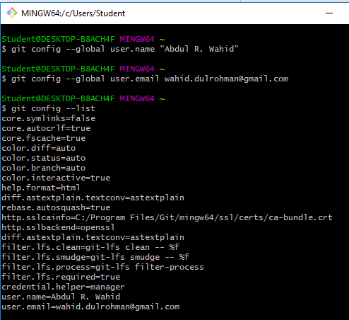
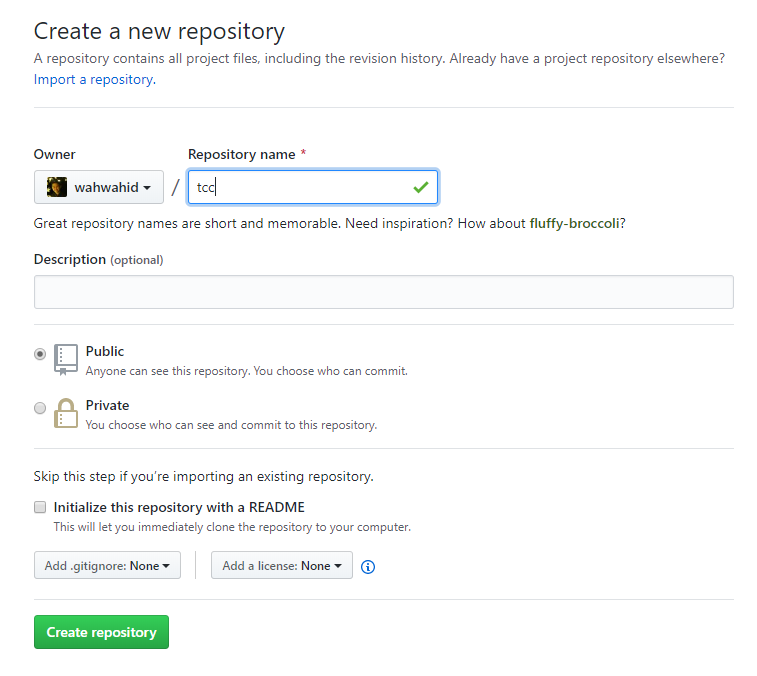
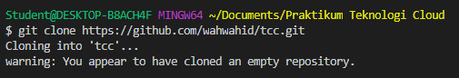
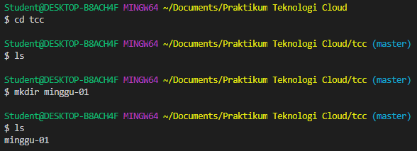
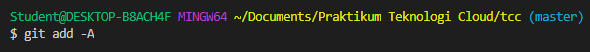
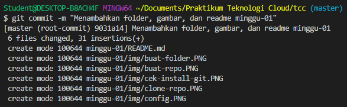
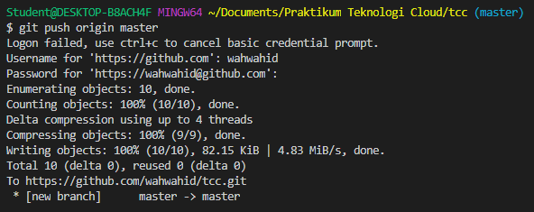
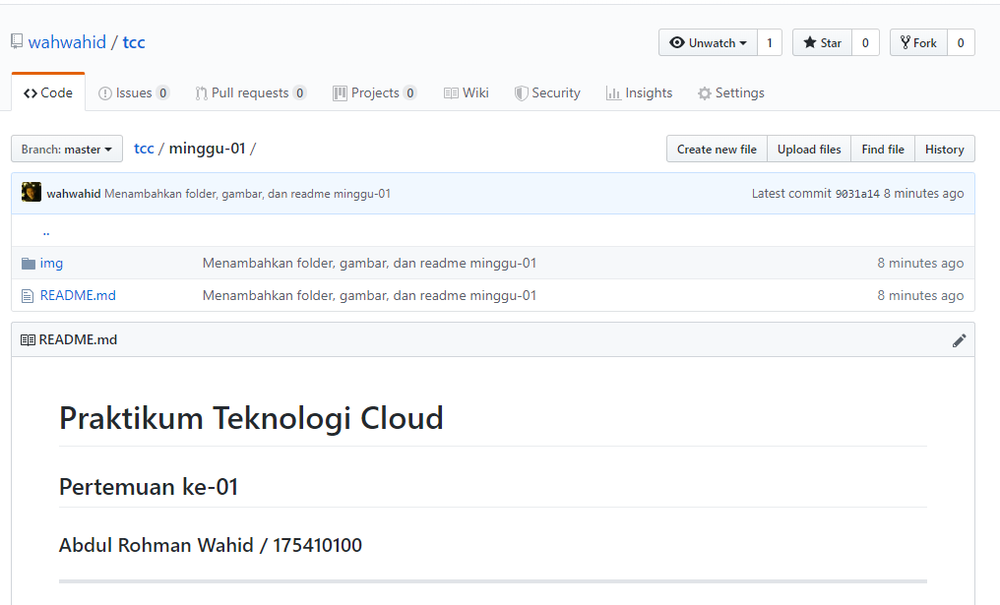

# Praktikum Teknologi Cloud
## Pertemuan ke-01

###  Abdul Rohman Wahid / 175410100
--------------------------------

### Langkah 01 Instalasi Git
Mengecek git yang terinstall di komputer dengan menggunakan perintah :
```
git --version
```


Gambar diatas menunjukkan bahwa git sudah terinstall dengan versi 2.20.1.windows.1

### Langkah 02 Konfigurasi GIT


### Langkah 03 Mengelola Repo
#### Membuat Repo


#### Clone Repo


#### Buat Folder


#### Buat File 
Membuat file [README.md](./README.md) ini

#### Menambahkan seluruh file ke staging


#### Commit perubahan staging


#### Me-push perubahan ke github


#### Melihat repository github online
