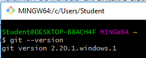

# Praktikum Teknologi Cloud
## Pertemuan ke-01

###  Abdul Rohman Wahid / 175410100
--------------------------------

### Langkah 01 Instalasi Git
Mengecek git yang terinstall di komputer dengan menggunakan perintah :
```
git --version
```



Gambar diatas menunjukkan bahwa git sudah terinstall dengan versi 2.20.1.windows.1

### Langkah 02 Konfigurasi GIT

Mengatur konfigurasi nama user menjadi "Abdul R. Wahid"
Mengatur konfigurasi email user menjadi "wahid.dulrohman@gmail.com"

### Langkah 03 Mengelola Repo
#### Membuat Repo

Membuat repositori di github

#### Clone Repo

Mengkloning / mengambil salinan repositori ke komputer lokal dengan perintah :
```
git clone "url-repo"
```

#### Buat Folder

Membuat folder praktikum di minggu pertama.

#### Buat File 
Membuat file [README.md](./README.md) ini

#### Menambahkan seluruh file ke staging

Menambahkan semua file ke staging dengan perintah
```
git add -A
```
Perintah `-A ` maksudnya adalah semua file yang berubah. Bila ingin file tertentu saja tulis nama filenya.

#### Commit perubahan staging

Mencatat perubahan yang dilakukan dan ditambahkan di staging dengan perintah commit. Contohnya :
```
git commit -m "Sebuah Komentar"
```
Commit harus diikuti dengan suatu komentar yang menerangkan perubahan apa yang terjadi di repositori.

#### Me-push perubahan ke github

Mem-push / mempublikasikan perubahan ke repository remote github. Perintah yang digunakan :
```
git push origin master
```
`origin` merupakan nama remote server default (dalam hal ini github)
serta `master` merupakan nama branch default yang digunakan.

#### Melihat repository github online

Gambar diatas merupakan hasil dari repository yang telah di push.