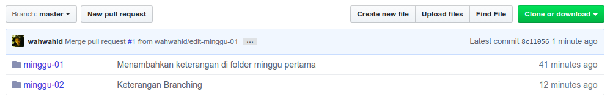

# Praktikum Teknologi Cloud
## Pertemuan ke-02

###  Abdul Rohman Wahid / 175410100
--------------------------------    

Pergi ke [Langkah sebelumnya](../minggu-01/README.md)

### Langkah 03 Mengelola Repo
#### Membuat Branch

Membuat branch sekaligus berpindah ke branch yang baru dibuat dengan perintah :
```
git checkout -b edit-minggu-01
```

#### Melakukan perubahan di Branch
Mengedit file maupun menambahkan file baru saat branch aktif adalah `edit-minggu-01`. Perubahan di simpan seperti biasa dengan `git add` dan `git commit` serta `git push` untuk mempublikasikannya.

#### Melihat hasil perubahan di Branch

Diatas adalah daftar perubahan yang telah terjadi di branch `edit-minggu-01` yang di cek menggunakan perintah 
```
git log
```

#### Kembali ke branch master

Kembali ke brach master dengan perintan `git checkout` tanpa menggunakan `-b` yaitu :
```
git checkout master
```

#### Perbedaan branch via github

Kita dapat melihat di github branch master telah memiliki folder `minggu-01` dan `minggu-02`. Namun folder `minggu-01` terakhir diupdate perubahan 12 hari yang lalu.

Ketika pindah ke branch `edit-minggu-01` maka kita tidak melihat folder `minggu-02` karena memang saat branch ini dibuat berdasarkan branch master, kondisi saat itu belum ada folder `minggu-02`. Namun, disini folder `minggu-01` terakhir ada update perubahan adalah 31 menit yang lalu.

#### Pull Request
Kita dapat menggabungkan perubahan dari 2 branch yang berbeda menggunakan `merge` yang bisa diperoleh secara remote dari fitur `pull request di github`

Membuat pull request branch `edit-minggu-01` ke `master`

Ditampilkan informasi bahwa branch yang dilakukan pull request tidak memiliki konflik dengan vranch master, karena itu aman untuk dilakukan merge.

Konfirmasi untuk melakukan merge branch pada pull request.

Dapat dilihat hasil pull request bahwa di branch `master` untuk folder minggu-01 telah berubah menjadi versi update / commit terakhir yang sama dengan branch `edit-minggu-01`

#### Sinkronisasi
Mengambil perubahan yang ada di remote server untuk diaplikasikan ke lokal. Perubahan dapat terjadi jika ada pull request maupun pengelolaan dari komputer lokal lain. Ke-tidak-sinkron-an perubahan dapat menyebabkan hal seperti gambar dibawah :

Gagal melakukan push karena di remote server telah ada perubahan yang berbeda dengan perubahan di lokal.

Untuk sinkronisasi perintah yang digunakan adalah :
```
git pull origin master
```
Dimana `origin` adalah server default, sedangkan `master` adalah branch default yang akan di sinkronisasi.
Git secara otomatis akan melakukan merge perubahan jika tidak ada konflik yang terjadi, yang perlu kita lakukan hanya menentukan komentar untuk auto-merge tersebut.
