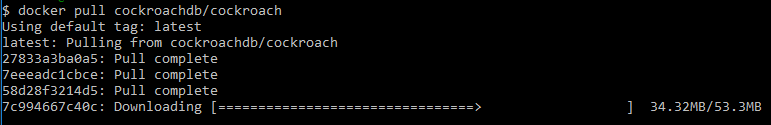

# CockroachDB
## Instalasi
Install CockroachDB di docker dengan menggunakan perintah :
```
docker pull cockroachdb/cockroach
```


Contoh images docker

## Konfigurasi
## Membuat Database
## Membuat Tabel
## UI Data
## Query Data