# CockroachDB
CockroachDB adalah basis-data SQL untuk membangun layanan cloud global yang scalable dan tahan bencana.

## Instalasi
CockroachDB tersedia untuk multi-platform mendukung sistem operasi Mac, Linux, dan Windows. Instalasinya tersedia dalam beberapa cara yaitu :
 * Package Manager
 * Binari / Executable
 * Kubernetes
 * Docker
 * Build Source

Cara instalasi yang dapat mewakili ketiga platform dan memiliki langkah-langkah yang identik adalah installasi menggunakan Docker. Berikut langkah-langkahnya :

### Cek ketersediaan docker
Cek ketersediaan docker pada komputer yang akan digunakan, pastikan docker sudah terinstall untuk lanjut ke proses instalasi.
```
docker -v
```
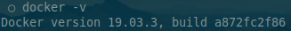

### Download docker image CockroachDB
Download docker image CockroachDB terbaru dari DockerHub
```
docker pull cockroachdb/cockroach
```
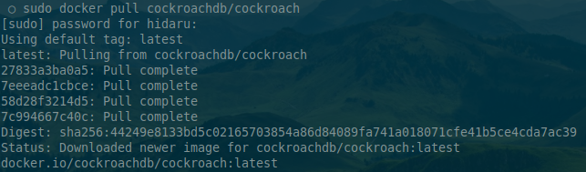

Cek docker image yang telah terdownload 
```
docker images
```
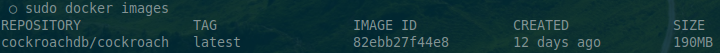

### Menjalankan container CockroachDB
Jalankan container 
```
docker run -d --name=cr-wahid --hostname=cr-wahid -p 26257:26257 -p 8080:8080 cockroachdb/cockroach start --insecure
```
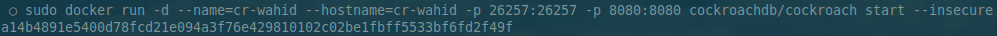

Perintah diatas menjalankan container dari docker image cockroachdb/cockroach dengan nama "cr-wahid" dan nama host "cr-wahid" dengan mode insecure serta mengexpose port 26257 dan 8080 ke host.

Cek container yang sedang berjalan
```
docker container ls -a
```
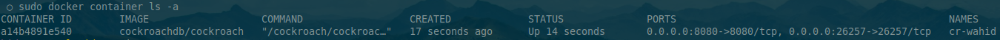

Pada gambar diatas dapat dilihat bahwa container "cr-wahid" sedang berjalan

Masuk ke container
```
docker exec -it cr-wahid /bin/bash
```
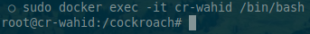

Shell telah berubah menjadi shell milik container.

## Konfigurasi
Menambahkan user dengan nama "cockroach"
```
./cockroach user set cockroach --insecure
```

Cek user yang tersedia
```
./cockroach user ls --insecure
```

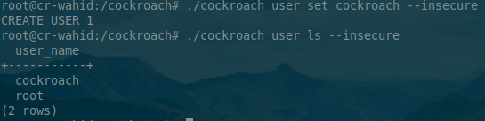

## Membuat Database
Membuat database dengan nama "hid"
```
./cockroach sql -e 'CREATE DATABASE hid' --insecure
```

Memberikan seluruh akses pada database "hid" ke user "cockroach"
```
./cockroach sql -e 'GRANT ALL ON DATABASE hid TO cockroach' --insecure
```

Melihat semua database yang ada
```
./cockroach sql -e 'SHOW DATABASES' --insecure
```
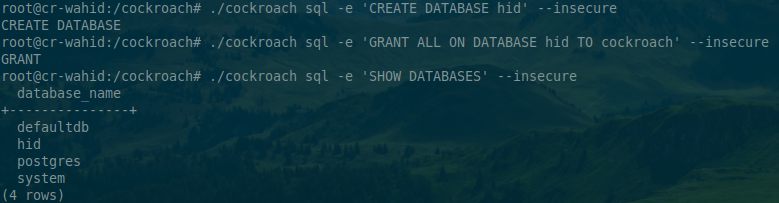

## Membuat Tabel
Jika sebelumnya menggunakan inline sql pada command-line, kali ini masuk ke SQL Interface terlebih dahulu.
```
./cockroach sql --insecure
```
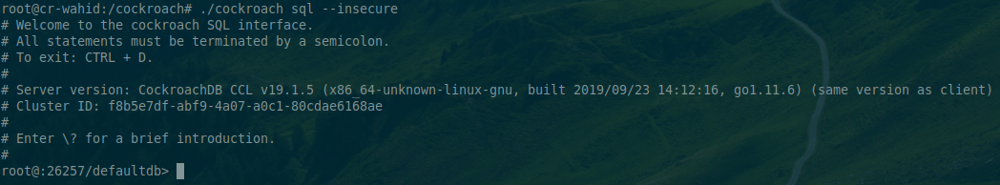

Menggunakan "hid" sebagai database aktif di interface
```
USE hid;
```
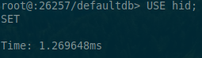

Membuat tabel mahasiswa dengan field nim dan nama
```
CREATE TABLE mahasiswa (
    nim INT PRIMARY KEY,
    nama VARCHAR(50)
);
```
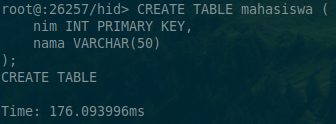

## Query Data
Menambahkan data ke tabel mahasiswa
```
INSERT INTO mahasiswa VALUES (
    175410100,
    'Abdul Rohman Wahid'
);
```
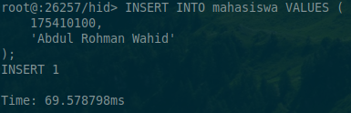

Melihat data dalam tabel mahasiswa
```
SELECT * FROM mahasiswa;
```
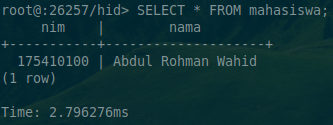

## Admin UI
CockroachDB memiliki User Interface untuk Administrasi berbasis web yang secara default dapat diakses dari port 8080.
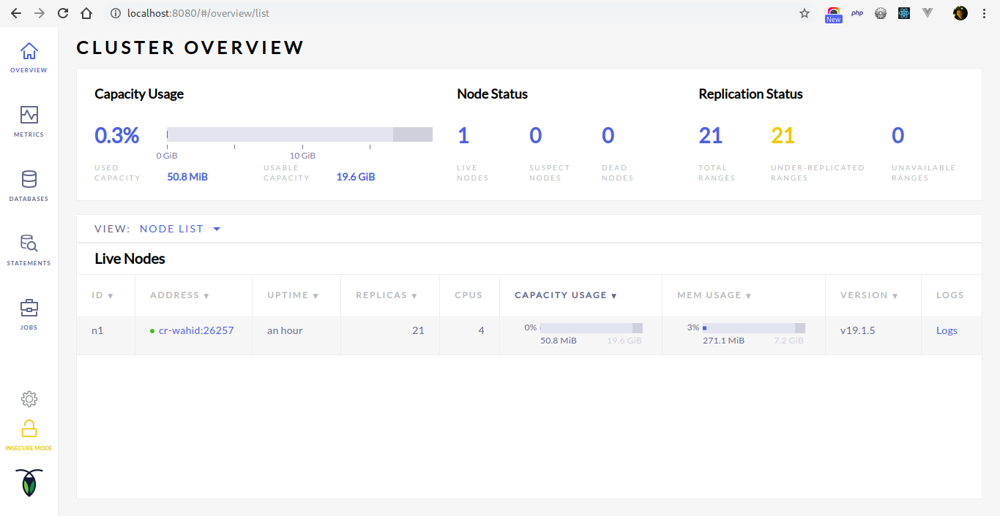
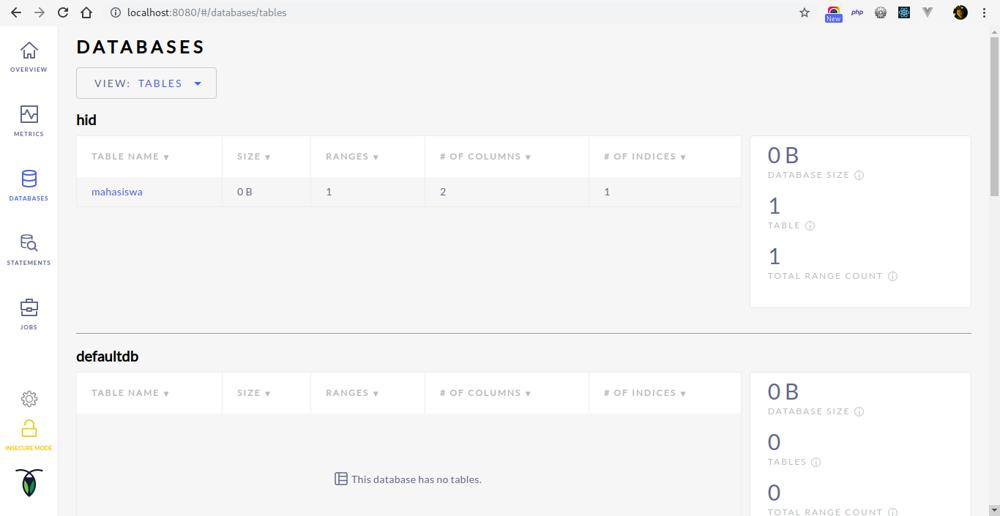

## Referensi
* https://www.cockroachlabs.com/docs/stable/install-cockroachdb-linux.html
* https://vladmihalcea.com/how-to-get-started-with-cockroachdb/
* https://www.cockroachlabs.com/docs/stable/sql-statements.html
* https://www.cockroachlabs.com/docs/stable/admin-ui-access-and-navigate.html