# Deploying First Container (Redis)

## Mencari docker image dengan nama "redis"
```
docker search redis
```


## Menjalankan docker image menjadi docker container secara background
```
docker run -d redis
```


## Melihat seluruh container yang sedang berjalan
```
docker ps
```


## Melihat detail dari suatu container yang sedang berjalan
```
docker inspect a72
```


## Melihat log dari suatu container yang sedang berjalan
```
docker logs a72
```


## Menjalankan container dan mengekspose suatu port secara statis
```
docker run -d --name redisHostPort -p 6379:6379 redis:latest
```


## Menjalankan container dan mengekspose suatu port secara dinamis
```
docker run -d --name redisDynamic -p 6379 redis:latest
```


## Mencari suatu port dari suatu container yang diekspose secara dinamis
```
docker port redisDynamic 6379
```


## Menjalankan docker yang menyimpan data di komputer host
```
docker run -d --name redisMapped -v /opt/docker/data/redis:/data redis
```


## Menjalankan docker image menjadi docker container secara foreground
```
docker run ubuntu ps
```


## Mengakses bash shell di dalam container
```
docker run -it ubuntu bash
```


# NGINX
## Membuat dockerfile
```
FROM nginx:alpine
COPY . /usr/share/nginx/html
```
Mendefinisikan basis docker image serta menyalin seluruh file yang ada di direktori kerja ke suatu tempat didalam container (/usr/share/nginx/html).

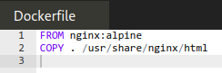

## Membuild docker image
```
docker build -t webserver-image:v1 .
```
Membuild dockerimage dengan nama "webserver-image" serta versi "v1"

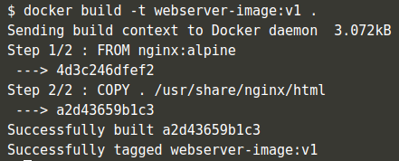

## Mengecek docker image
```
docker images
```
Menampilkan daftar docker image yang tersedia di komputer host

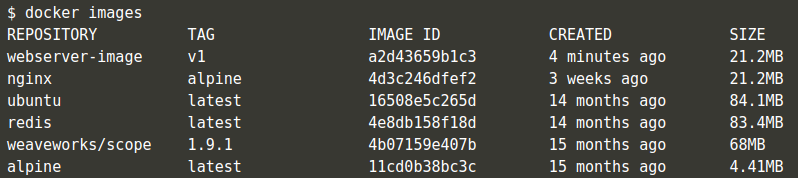

## Menjalankan docker container
```
docker run -d -p 80:80 webserver-image:v1
```
Menjalankan docker container di background serta mengekspose secara static port 80 ke port 80 dari docker image yang baru dibuat (webserver-image:v1)

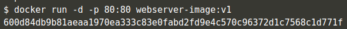

## Mengecek NGINX
```
curl docker
```
Mengecek webserver nginx yang ada didalam docker telah berjalan dengan melakukan HTTP request menggunakan curl ke host "docker"

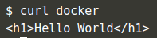

# Building Container Images

## Step 1 - Base Images
Menentukan basis dari docker image yang akan digunakan. Disini kita akan menggunakan basis docker image dari "nginx:1.11-alpine"
```
FROM nginx:1.11-alpine
``` 

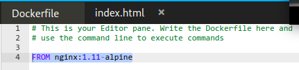

## Step 2 - Running Commands
Menuliskan perintah-perintah yang akan dieksekusi ketika docker images dijalankan menjadi docker container. Disini kita akan menjalankan perintah untuk menyalin file "index.html" yang ada pada direktori aktif ke suatu direktori di dalam docker image yaitu "/usr/share/nginx/html"

Sebelumnya kita siapkan terlebih dahulu file "index.html", contoh sebagai berikut :
```html
<h1>Kulanuwun Donya !!!</h1>
```

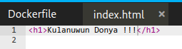

Kemudian kita tambahkan perinyah ke dalam dockerfile

```
COPY index.html /usr/share/nginx/html/index.html
```

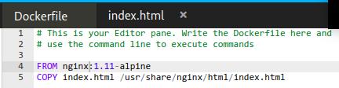

## Step 3 - Exposing Ports
Menentukan port yang perlu di ekspose oleh docker. Disini kita akan mengekspose port 80.
```
EXPOSE 80
```

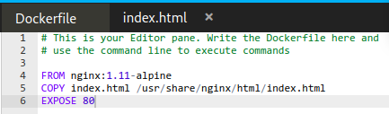

## Step 4 - Default Commands
Menentukan perintah baku yang akan dijalankan docker untuk meluncurkan aplikasi. Disini perintah yang akan kita atur adalah :
```
nginx -g daemon off;
```

Penulisannya akan menjadi seperti dibawah ini pada dockerfile
```
CMD ["nginx", "-g", "daemon off;"]
```

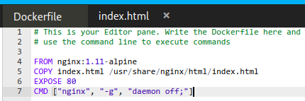

## Step 5 - Building Containers
Membuild suatu docker image container. Disini kita akan membuild docker image dari dockerfile yang sudah kita siapkan sebelumnya, nama image yang akan dibuat adalah "sleman-nginx"
```
docker build -t sleman-nginx:latest .
```

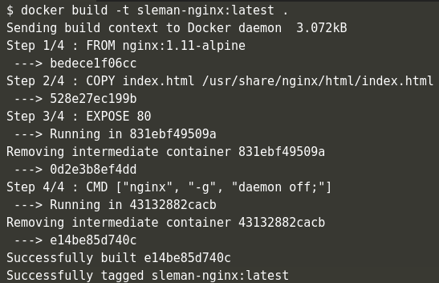

Cek docker image yang telah di build menggunakan perintah
```
docker images
```

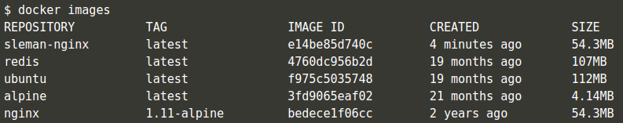

## Step 6 - Launching New Image
Menjalankan docker image yangtelah di build menjadi suatu docker container.
```
docker run -d -p 80:80 sleman-nginx:latest
```

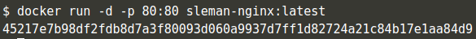

Daftar docker container yang berjalan dapat dilihat dengan menggunakan perintah 
```
docker ps
```

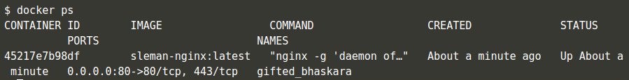

Untuk megecek docker container yang kita buat, kita dapat mengakses protokol HTTP / port 80 menggunakan curl 
```
curl docker
```

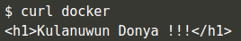

Bisa juga dengan mengaksesnya melalui browser

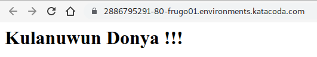