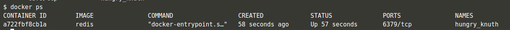

# Deploying First Container (Redis)

## Mencari docker image dengan nama "redis"
```
docker search redis
```


## Menjalankan docker image menjadi docker container secara background
```
docker run -d redis
```


## Melihat seluruh container yang sedang berjalan
```
docker ps
```


## Melihat detail dari suatu container yang sedang berjalan
```
docker inspect a72
```


## Melihat log dari suatu container yang sedang berjalan
```
docker logs a72
```


## Menjalankan container dan mengekspose suatu port secara statis
```
docker run -d --name redisHostPort -p 6379:6379 redis:latest
```


## Menjalankan container dan mengekspose suatu port secara dinamis
```
docker run -d --name redisDynamic -p 6379 redis:latest
```


## Mencari suatu port dari suatu container yang diekspose secara dinamis
```
docker port redisDynamic 6379
```


## Menjalankan docker yang menyimpan data di komputer host
```
docker run -d --name redisMapped -v /opt/docker/data/redis:/data redis
```


## Menjalankan docker image menjadi docker container secara foreground
```
docker run ubuntu ps
```


## Mengakses bash shell di dalam container
```
docker run -it ubuntu bash
```


# NGINX
## Membuat dockerfile
```
FROM nginx:alpine
COPY . /usr/share/nginx/html
```
Mendefinisikan basis docker image serta menyalin seluruh file yang ada di direktori kerja ke suatu tempat didalam container (/usr/share/nginx/html).

## Membuild dockerimage
```
docker build -t webserver-image:v1 .
```
Membuild dockerimage dengan nama "webserver-image" serta versi "v1"