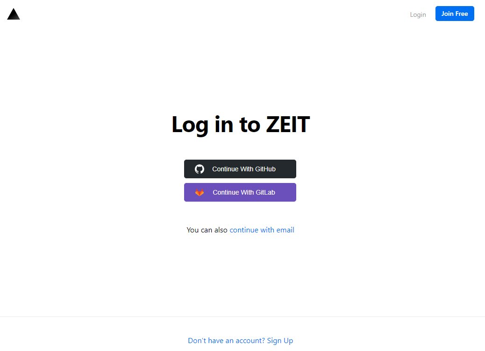
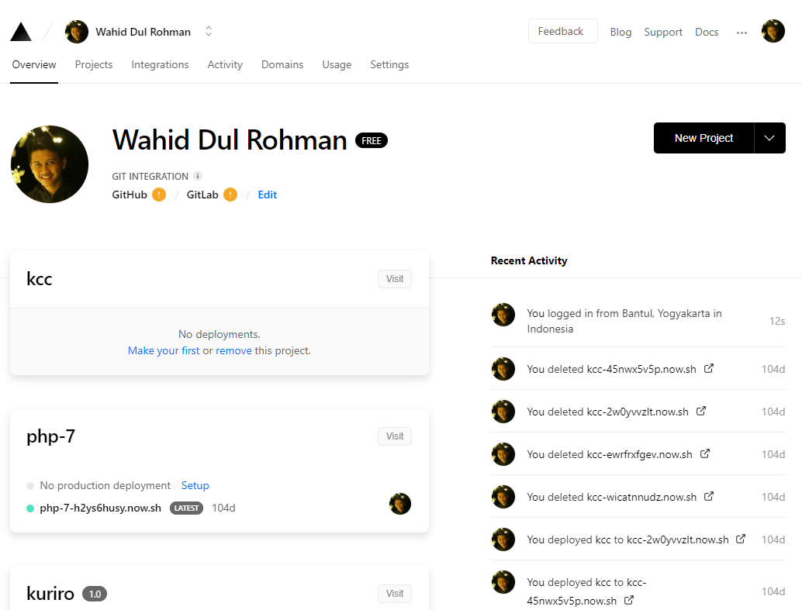
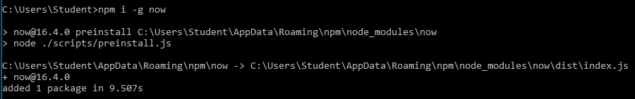
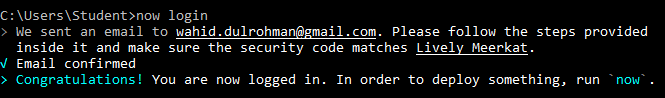
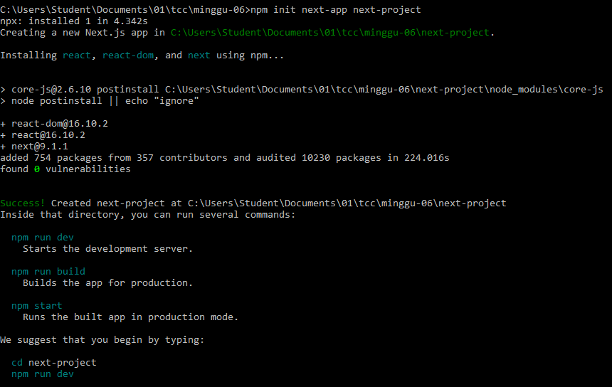
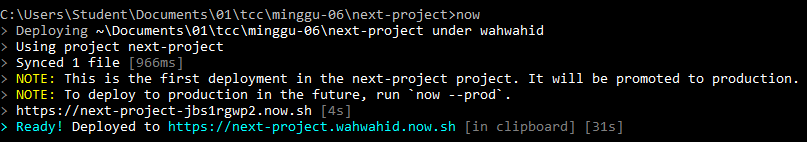
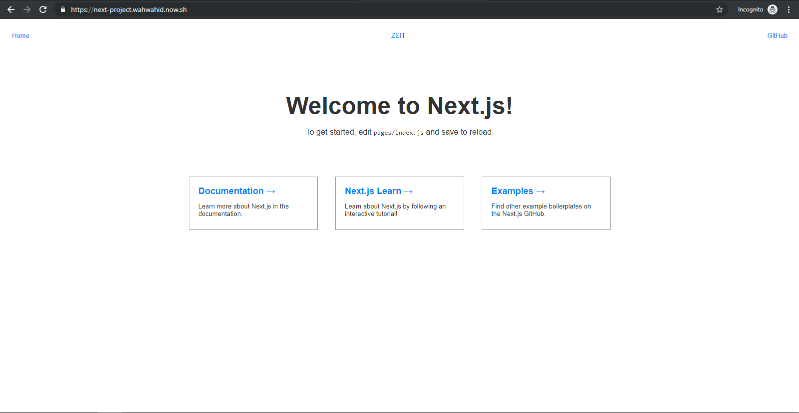
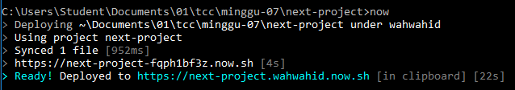
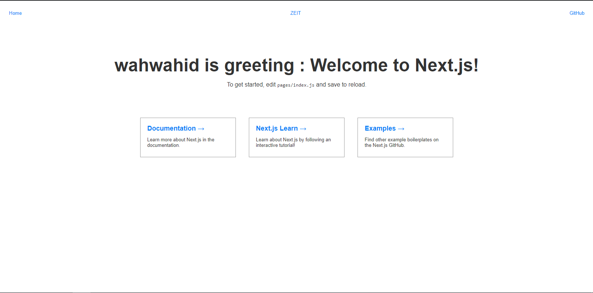

# Minggu 7 : ZEIT - now
## Sign In / Sign Up
Sign In / Sign Up ke ZEIT https://zeit.co/login menggunakan akun GitHub / GitLab / Email



## Install now di komputer
```
npm i -g now
```



## Login now di komputer
```
now login
```


## membuat project baru
Membuat project dengan next-app
```
npm init next-app next-project
```


## Mendeploy di now
```
now
```


## Hasil Deploy


## Modifikasi halaman next-project
```
~/pages/index.js

...
<h1 className='title'>wahwahid is greeting : Welcome to Next.js!</h1>
...
```

## Re-deploy
```
now
```


## Hasil Re-deploy

