# Minggu 10 : GitHub untuk Kolaborasi

## Step 01
Membuka suatu repository GitHub kemudian melakukan fork

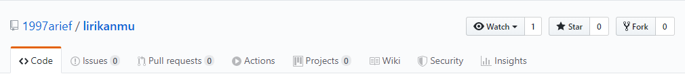

## Step 02
Akan terbuat repository di akun pribadi. Selanjutnya lakukan clone.

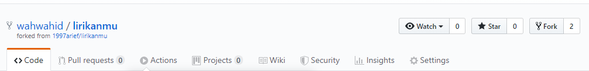

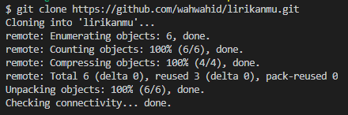

## Step 03
Buat branch baru dan lakukan perubahan

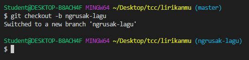

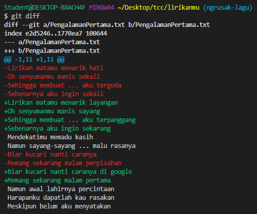

## Step 04
Commit dan Push berubahan

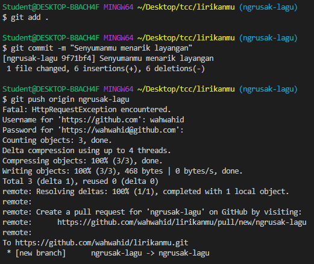

## Step 05
Melakukan Pull Request

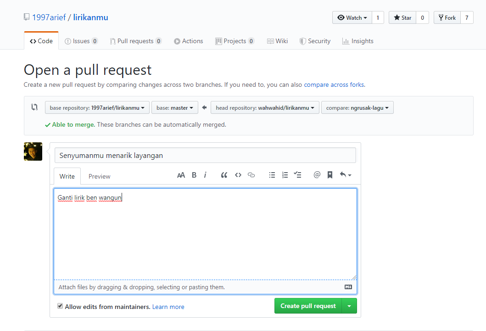

## Step 06
Pull Request dikirim dan teranalisa secara otomatis menunjukkan ada / tidak ada konflik (dalam kasus ini tidak ada)

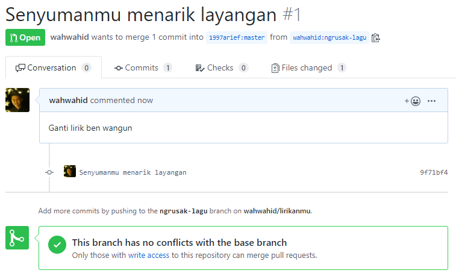

## Step 07
Pull Request diterima dan telah di merge ke branch master

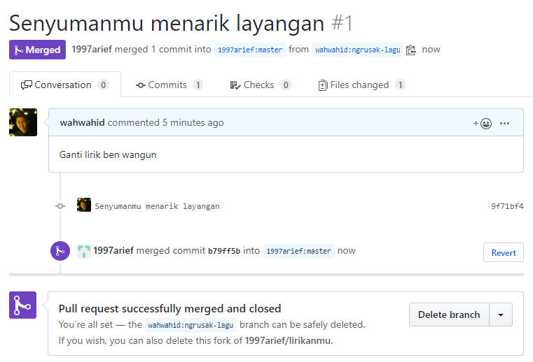

## Step 08
Membuat perubahan lain dan ternyata conflict

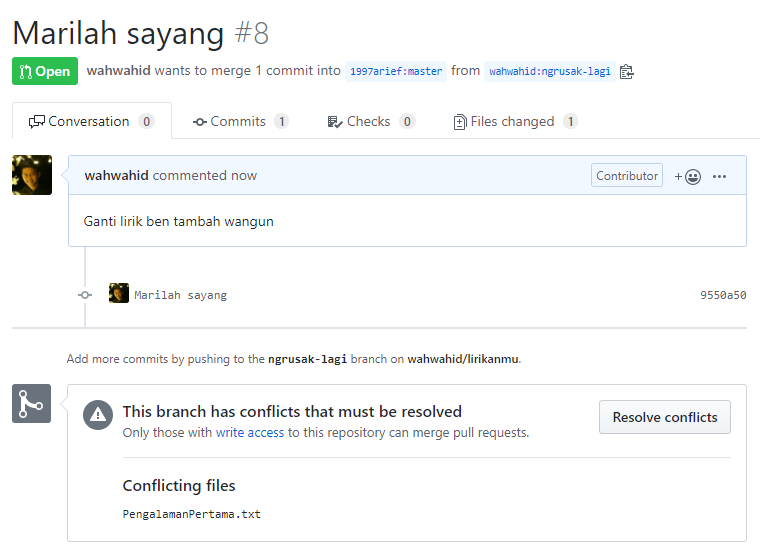

## Step 09
Me-resolve conflict langsung di GitHub

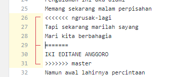

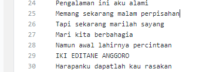

## Step 10
Pull Request sudah tidak conflict

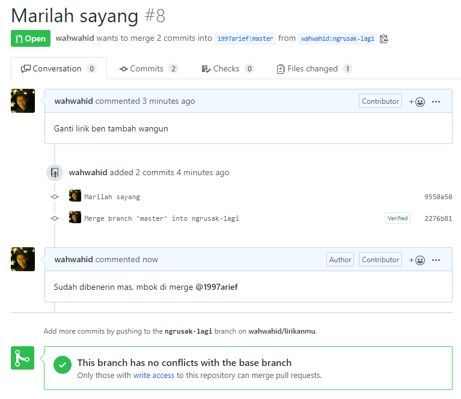

## Step 11
Pull request kedua telah diterima dan dimerge

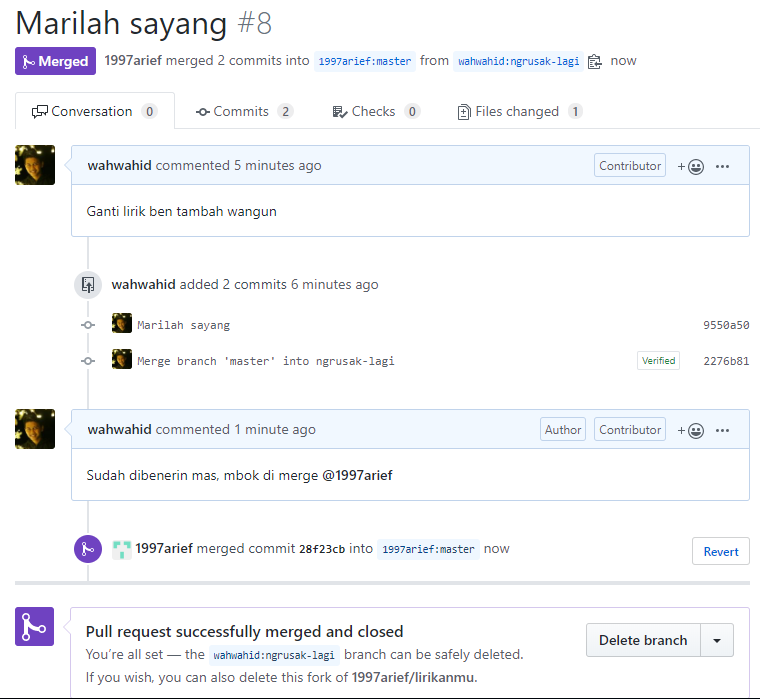
