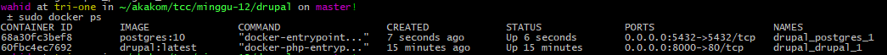

# Minggu 12 : Docker Compose - Drupal

## Langkah 1 : Buat file docker-compose.yml


## Langkah 2 : Jalankan docker compose

```
# docker-compose up -d
```


## Langkah 3 : Cek docker container yang sedang berjalan

```
# docker ps
```



## Langkah 4 : Buka url sesuai dengan konfigurasi
Dalam praktik ini http://localhost:8000/

