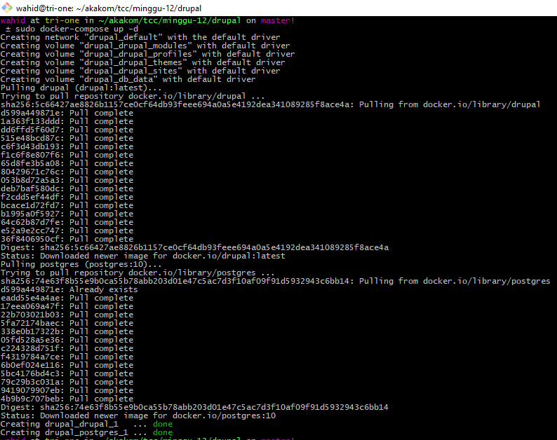

# Minggu 12 : Docker Compose - Drupal

## Langkah 1 : Buat file docker-compose.yml

## Langkah 2 : Jalankan docker compose

## Langkah 3 : Buka url sesuai dengan konfigurasi
Dalam praktik ini http://localhost:8000/

